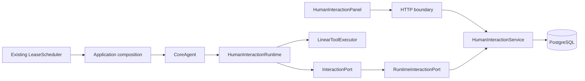

# 人在回路：受控运行首版实现

实现日期：2026-08-31。依据 `_doc/agent-human-in-the-loop-design.md` 的三项最低能力交付路径，落地普通聊天根 Agent 的主动反问、执行前审批和暂停后引导续跑。默认关闭，未部署到当前业务实例。

本报告描述当前代码和验证边界；原设计中的全部业务整合、外部执行适配和后台 HA 目标不等同于本次已交付能力。

## 1. 能力与边界

| 能力 | 当前行为 |
| --- | --- |
| 主动反问 | ReAct / Planning 可调用 `ask_user(question, options=None)`；回答后恢复同一 `run_id` 和原调用位置 |
| 执行前审批 | 除内置 final_answer 和本地计划管理工具之外，所有工具保守要求人工批准；模型无法自行跳过审批 |
| 暂停与引导 | 模型生成中、工具在途及等待人工时均可请求暂停；到安全边界挂起，提交意见后保留已完成事实并放弃旧代码未执行后缀 |
| Planning | 计划、当前步骤和版本持久化；恢复后不自动把拒绝的动作对应步骤标为完成；新意见交给模型重评计划 |
| 幂等和恢复 | 相同决定重复提交返回同一回执；成功调用回放结果；不确定副作用禁止自动重试 |
| 刷新与断线 | 待办从 PostgreSQL 重载，SSE 重新订阅不触发新运行；浏览器离开不取消 producer |
| 原功能兼容 | 普通聊天默认原路径；NL2Agent、自动化提案、MCP 权限和旧卡片保留原业务实现 |

首版只开放 JSON 值和线性工具调用。附件、托管子 Agent、A2A、任意 Python、并行执行和 sandbox continuation 不支持；不得用审批模式替代这些执行器的专门安全适配。工具自身内部仍可能访问网络或调用其他系统，审批针对该工具的一次注册调用，不构成对工具内部实现的沙箱隔离。

主动提问受模型行为影响；运行时提供真实工具和明确上下文，不保证任何模型在所有模糊问题上都主动调用。

## 2. 代码分析与依赖方向

原 `resume=true` 主要恢复 StreamingChannel / Redis 中的输出，没有保存 Python 执行位置。原 `stop_event` 是协作停止信号，不能承载人工等待。Planning 原 PlanRepo、质量验证器和业务确认卡片各有职责，不能直接充当通用审批边界。

本次采用独立协议与适配层：



| 模块 | 职责 |
| --- | --- |
| `sdk/nexent/core/human_interaction/contracts.py` | 挂起、终止、待核对控制类型与宿主端口；SDK 不读取数据库和环境变量 |
| `executor.py` / `codec.py` | 整段执行前 AST 检查、稳定调用槽位、显式 JSON 检查点编解码；不使用 eval、exec 或 pickle |
| `runtime.py` | Agent 检查点、工具调用、计划适配和 steering；不依赖 FastAPI 或业务卡片 |
| `backend/services/human_interaction/service.py` | owner scope、请求生命周期、决定 CAS、幂等、到期和控制 |
| `runtime_port.py` | 冻结参数、调用账本、租约 fencing、执行前重新授权和事件持久化 |
| `application.py` | 复用现有 Agent 准备/流式输出与 LeaseScheduler；统一组装依赖 |
| `backend/apps/human_interaction_app.py` | HTTP 身份解析、输入校验、异常映射 |
| `frontend/features/humanInteraction/` | 独立 API client 与问题、审批、暂停、终止面板 |

CoreAgent 仅增加可选生命周期接入点。未启用 HITL 时保持原 executor、工具 guardrail、隐式计划收尾及旧流式行为。新控制类型继承 BaseException，避免被既有 `except Exception` 工具包装器转换成普通字符串后继续运行。

## 3. 持久化与安全语义

新增四张表：`human_run_t`、`human_request_t`、`human_execution_t`、`human_event_t`，建表脚本为 `deploy/sql/migrations/v2.6.0_merged_migrations.sql`，未修改已合入 develop 的 SQL。


### 数据库字段与写入约束

模型统一定义在 `backend/database/db_models.py`，继承 `TableBase`。原 `human_interaction_models.py` 保留导入兼容。

| 表 | 单列技术主键 | 业务标识与关系 |
| --- | --- | --- |
| `human_run_t` | `run_record_id INT4`，自增 | `run_id VARCHAR(36)` 保留公开 UUID；`conversation_id INT4` 逻辑关联会话 |
| `human_request_t` | `request_record_id INT4`，自增 | `run_record_id INT4` 关联 run；`request_id VARCHAR(36)` 保留公开 UUID |
| `human_execution_t` | `execution_id INT4`，自增 | `run_record_id INT4` 与 `slot VARCHAR(100)` 标识调用位置 |
| `human_event_t` | `event_id INT4`，自增 | `run_record_id INT4` 与 `seq BIGINT` 标识 SSE 重放位置 |

- 四张表包含 `created_by`、`create_time`、`updated_by`、`update_time`、`delete_flag` 五个审计字段，所有列均有数据库英文注释。审计时间按 UTC 存为 `TIMESTAMP`；租约和请求过期时间保留 `TIMESTAMPTZ`。用户操作记录用户，调度器/租约维护记录 `system:hitl`。事务中的每次写入维护审计信息；触发器同时保证原始 SQL 更新刷新时间并保留创建信息，原始 SQL 调用者须显式提供操作人。
- 状态/种类为 `VARCHAR(30)`，service 层统一验证状态集合、非负整数范围、标记和字符串长度。工具名称及 worker 标识上限为 200，slot/idempotency key 上限为 100。技术主键容量为正 INT4；`event_seq/seq` 为高频流式事件计数而非技术主键，继续使用 BIGINT，避免改变既有 SSE 游标范围。
- 不声明外键、业务唯一约束或唯一索引。创建 run 时在同一事务持有公开 UUID 和 `(tenant_id, user_id, conversation_id)` 的 advisory lock，service 检查公开 ID 不重用、会话归属及唯一活动 run。后续写入持有父 run 行锁，验证整数引用、一条活动待办、每个调用 slot 一条活动回执及不重复的事件序号。审批版本和幂等摘要继续由 service 检查。所有正常查询过滤 `delete_flag='N'`；通过 run 事务软删父记录时，同一事务软删请求、执行回执和事件并更新审计。
- 仅 `human_event_t.payload` 使用 JSONB：必须是 `{chunk_cipher: string}` 或 `{type: string, content: object}`，拒绝非法 JSON 值。输出块先加密。其余 payload/checkpoint/plan/arguments/result 是服务或 SDK 所有的可变 JSON 快照，Fernet 密文以 TEXT 保存；可空字段表示尚未生成，不给可变模型输出设任意固定长度。决定文本沿用 8000 字符等原有命令校验。
- 非唯一索引分别支撑公开 run 查询、owner 会话历史、调度领取、run 请求查询、调用 slot 回放及 SSE 顺序分页；活动行索引统一包含软删过滤条件。
- 建表脚本面向新功能的全新数据库，直接创建四张表、非唯一索引、字段注释和审计触发器。

- PostgreSQL 是事实来源，READY run 本身就是可重新领取的持久执行队列；等待人工时结束 worker attempt 并释放租约，保留逻辑运行占位。
- run 行锁串行化决定、暂停、终止和工具派发。请求版本、动作摘要与幂等键由服务端核验，客户端不能指定身份或执行状态。
- 工具参数在内容 guardrail 后冻结；动作 HMAC 绑定 run、owner、调用槽位、工具、参数、配置摘要和策略版本。恢复时检查工具配置和注册类实现摘要。
- 每个调用以 `step_number:statement_index` 为稳定槽位，独立于参数摘要。SUCCEEDED / REJECTED 回放结果；STARTED / UNKNOWN 转为 RECOVERY_REQUIRED，禁止猜测是否成功。
- 工具实际返回后先保存执行回执，再做结果质量检查。结果校验失败、执行后表达式错误或聊天记录落库失败，均不能引发盲目重试副作用。
- 最终输出写入检查点；完成检查点后进程崩溃，不重新调用模型来生成已完成的答案。
- 新 worker 领取时递增 fence。旧 worker 失去租约后无权获取新动作或写入回执。工具内部已经开始的外部操作不能被数据库 fence 撤销。
- 参数、答案、上下文、计划、检查点和输出块以 Fernet 加密存储；审批投影对常见凭据字段递归脱敏。任意自然语言中的秘密无法仅依靠字段名保证识别，用户不得在回答中输入密钥。
- SSE 按 run 内事件序号重放；输出块批量写入事务（最多 32 块，持续产出时约 250ms 刷新），收尾强制刷出。人类控制状态不依赖 token 输出到达顺序。
- 收到终止请求后不再派发尚未开始的动作；在途工具可能继续执行并写入回执。终止不是外部操作回滚。

RECOVERY_REQUIRED 必须先检查下游事实。当前没有“强制成功”或“忽略不确定状态继续”接口，也不提供自动对账；可以终止逻辑任务后由操作人员依据下游证据处理，不应直接重新发送原指令。

## 4. HTTP 与页面使用

在现代聊天 `/newchat` 输入框上方开启“人在回路（受控工具执行）”，再发送普通聊天。服务未启用时面板不显示。运行中可暂停并补充意见、批准/拒绝一次动作或终止任务；断开输出后可重新连接。

| 接口 | 行为 |
| --- | --- |
| `POST /agent/run`，`enable_hitl: true` | 新建受控逻辑运行，返回 SSE 和 run_id |
| `POST /agent/run`，`hitl_run_id`、`hitl_after_event` | 订阅现有运行输出，不创建新运行 |
| `GET /agent/human-interactions/capabilities` | 查询开关与首版执行范围 |
| `GET /agent/human-interactions/conversation/{id}` | 获取当前 owner 在会话中的最近运行及待办 |
| `GET /agent/human-interactions/{run_id}` | owner scope 快照 |
| `POST /agent/human-interactions/{run_id}/requests/{request_id}/decisions` | 提交版本、digest、idempotency_key、decision 和可选 text |
| `POST /agent/human-interactions/{run_id}/pause` | 请求在安全边界暂停；等待人工时转换为意见输入 |
| `POST /agent/human-interactions/{run_id}/terminate` | 终止逻辑运行、撤销待处理请求 |

决策命令仅接受 `answer`、`approve`、`reject`、`steer`，允许的组合由请求类型决定。跨 owner / tenant 返回 404；过期返回 410；版本或状态冲突返回 409；未知字段和非法答案返回 422。批准时不接受修改参数；需要修改应拒绝并给出意见，或暂停后提交新约束。

## 5. 启用与回退

配置样例：`deploy/env/hitl.env.example`。不要直接覆盖现有 `.env`。

1. 初始化数据库时执行新增建表脚本。当前工作仅在隔离测试库执行了此脚本。
2. 为全部 runtime 实例配置同一持久 Fernet 密钥 `HITL_ENCRYPTION_KEY`，放在部署 secret 中，不提交 Git、不打印到日志。密钥丢失后现有运行无法恢复；首版不支持在线轮换。
3. 设置 `HITL_ENABLED=true`，`HITL_ACCEPT_NEW_RUNS=true`。`HITL_WAIT_SECONDS` 默认 86400，`HITL_MAX_CONCURRENCY` 默认 2。没有有效密钥时启动失败关闭。
4. 重建并更新包含 SDK、后端、建表 SQL 和前端的发布产物，先用无副作用工具灰度检查，再接入需要批准的动作。

如需本地生成密钥文件，可在项目根目录运行以下命令；命令只写文件，不输出密钥，文件已存在时拒绝覆盖：

```bash
backend/.venv/bin/python - <<'PY'
import os
from cryptography.fernet import Fernet
fd = os.open('/tmp/nexent-hitl-key', os.O_WRONLY | os.O_CREAT | os.O_EXCL, 0o600)
with os.fdopen(fd, 'wb') as output:
    output.write(Fernet.generate_key())
PY
```

回退时先设置 `HITL_ACCEPT_NEW_RUNS=false` 并滚动重启：停止接收新 HITL 运行，但保持 `HITL_ENABLED=true`，让既有请求、恢复队列和终止接口继续可用。确认既有运行全部完成/终止后，再关闭总开关。切勿删除迁移或密钥，也不要把关闭审批理解为待批动作获得批准。

## 6. 验证证据

### PR #3927 SQL 检视修订验证（2026-09-15）

在独立 PostgreSQL 15 临时容器中运行 **212 项定向测试，全部通过**：数据库规范/建表回归 30 项，既有 PostgreSQL + CoreAgent 集成 68 项，HTTP/流式/SDK 回归 114 项。没有调用真实外部模型或修改业务数据库。

- 每项数据库测试均从空 schema 执行一次建表脚本，验证创建后的模型映射及完整 HITL 流程。
- 验证单列 INT4 主键、整数逻辑关联、五个审计字段、全部字段注释及 JSONB 类型；没有外键、业务唯一约束或数据库状态 CHECK。
- 验证并发创建只产生一个活动 run、并发请求只保留一条待办、并发事件没有重复/缺号，以及原有审批幂等、跨租户隔离和执行回执保护。
- 验证创建/审批/调度/租约/原始 SQL 的审计维护、非 UTC 数据库会话、父子软删、字段边界和 BIGINT SSE 游标兼容。
- 以 5000 条 run、50000 条 event 执行 `EXPLAIN (ANALYZE, BUFFERS)`：历史查询、调度领取和事件重放均使用对应非唯一索引。该检查不等于生产容量压测。
- 数据库回归测试文件的 Ruff 检查及 `git diff --check` 通过；Ruff 导入检查按项目模块作为 first-party 配置执行。

```bash
HITL_TEST_DATABASE_FILE=/absolute/path/to/isolated-test.dsn \
  backend/.venv/bin/python -m pytest -q \
  test/backend/database/test_human_interaction_persistence.py \
  test/backend/services/test_human_interaction.py \
  test/backend/app/test_human_interaction_app.py \
  test/backend/app/test_northbound_human_interaction_app.py \
  test/backend/services/test_human_interaction_stream.py \
  test/sdk/core/agents/test_human_interaction_runtime.py \
  test/sdk/core/agents/test_run_agent_hitl.py \
  test/sdk/core/agents/test_clarification_form.py
```

### 功能初版的历史验证记录

以下 **1304 项通过** 为初版记录，本次 SQL 修订未全量重跑此清单：

| 测试范围 | 通过数 |
| --- | ---: |
| 新增真实 PostgreSQL + CoreAgent 集成 | 25 |
| Agent 服务 / Agent API | 458 / 115 |
| CoreAgent / Planning / run_agent | 154 / 26 / 31 |
| NL2Agent | 43 |
| 自动化 facade / runner / scheduler / adapter | 37 / 15 / 9 / 17 |
| StreamingChannel / runtime state / run manager | 39 / 21 / 23 |
| observer / parallel executor / PlanRepo | 105 / 17 / 21 |
| 通用 LeaseScheduler / conversation DB | 13 / 135 |

新集成测试使用专用 PostgreSQL `hitl_test` 数据库，计数型下游工具和真实 SDK executor，包含 ReAct/Planning 多次 worker 重建、审批前零执行、同 key 并发决定、拒绝/过期/撤权、模型与工具阶段暂停、租约失效、参数/工具实现漂移、完成收尾崩溃、已排队决定与失败收尾竞争、API 伪造字段和跨租户访问。API 身份及生产模型准备过程部分使用替身；不代表完整外部模型/MCP/业务实例验收。

测试会重建指定库的 `nexent` schema，仅允许数据库名为 `hitl_test`，绝不能使用业务数据库：

```bash
HITL_TEST_DATABASE_FILE=/absolute/path/to/isolated-test.dsn \
  backend/.venv/bin/python -m pytest -q test/backend/services/test_human_interaction.py
```

旧 SDK 测试会改写 `sys.modules`，相关文件需分别运行，避免历史 mock 隔离方式互相干扰。

前端新增组件完成独立打包和针对性 ESLint 检查。全项目 TypeScript 检查仍受已有 `.next/types` 引用不存在页面和本地未安装 `@assistant-ui/react-lexical` 阻塞；未宣称完整前端构建通过。浏览器安全策略阻止本地预览访问，尚未完成真实页面点击、刷新和多标签 E2E。

## 7. 后续范围

以下内容仍属于后续阶段，不能从本次测试推断已经支持：

- NL2Agent NEXT_TURN、资源安装/绑定和自动化提案迁入统一交互协议；本次仅回归其原有实现。
- 后台自动化的人工 WAIT、任务 occurrence / 游标结算和完整 HA 演练。
- 子 Agent / 并行分支、MCP Elicitation、A2A 和 sandbox 的 durable continuation。
- 外置 artifact codec、外部工具可靠幂等对账、审计查询和指标管理页面。
- 业务确认类独立 continuation registry、多审批人和委托授权。
- 跨 attempt 合并到同一条原生 assistant message：当前保持同一逻辑 run，历史消息仍按各 attempt 落库。
- 密钥轮换、容量与性能压测、真实模型和浏览器端到端验收。远端工具内部实现变更未必能被本地注册摘要发现。
